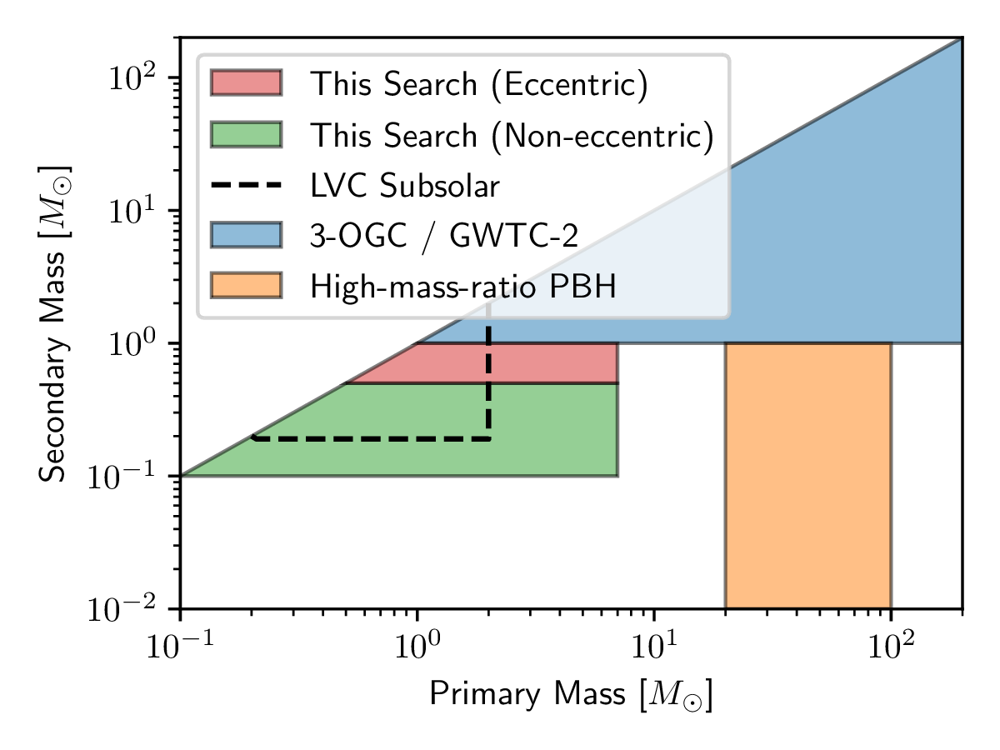
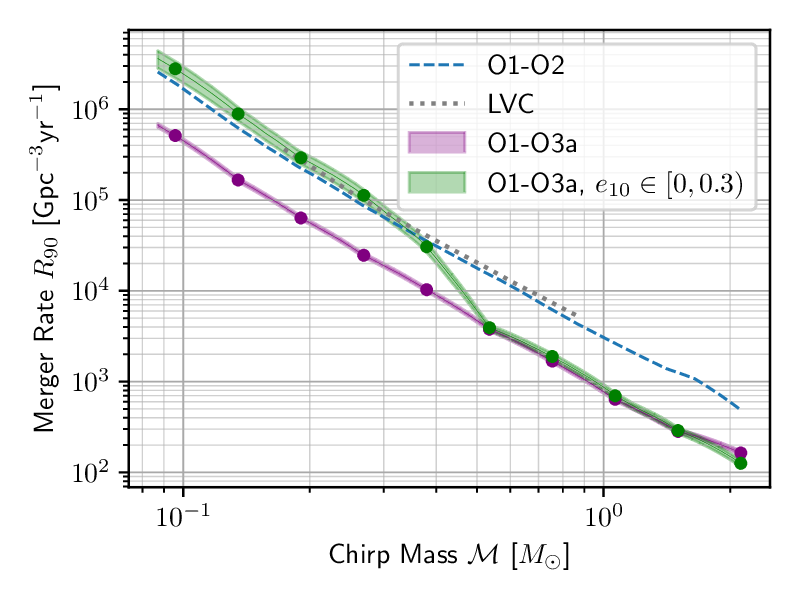

# Search for gravitational waves from the coalescence of sub-solar mass binaries in the
first half of Advanced LIGO and Virgo’s third observing run
**Alexander H. Nitz<sup>1, 2</sup>, Yi-Fan Wang<sup>1, 2</sup>**

 <sub>1. [Albert-Einstein-Institut, Max-Planck-Institut for Gravitationsphysik, D-30167 Hannover, Germany](http://www.aei.mpg.de/obs-rel-cos)</sub>
 <sub>2. Leibniz Universitat Hannover, D-30167 Hannover, Germany</sub>

## Introduction ##

We present a search for gravitational waves from the coalescence of sub-solar mass black hole
binaries using data from the first half of Advanced LIGO and Virgo’s third observing run. The
observation of a sub-solar mass black hole merger is a clear indication of primordial origin; primordial
black holes may contribute to the dark matter distribution. We search for black hole mergers where
the primary mass is 0.1−7M and the secondary mass is 0.1−1M. A variety of models predict the
production and coalescence of binaries containing primordial black holes; some involve dynamical
assembly which may allow for residual eccentricity to be observed. For component masses > 0.5M,
we also search for sources in eccentric orbits, measured at a reference gravitational-wave frequency
of 10 Hz, up to e10 ∼ 0.3. We find no convincing candidates and place new upper limits on the rate
of primordial black hole mergers. The merger rate of 0.5-0.5 (1.0-1.0) M sources is < 7100 (1200)
Gpc−3 yr−1. Our limits are ∼ 3 − 4× more constraining than prior analyses.


A preprint version of the paper is [available on arxiv](https://arxiv.org/abs/).
This release contains configuration files of the search. 

The rate limits are contained in two text files in the 'upper_limits' folder. These contain the limits
as a function of chirpm mass for the merger rate for non-eccentric sources as well as for a populuation
where the eccentricity ranges from 0 to 0.3. 




## License and Citation


This work is licensed under a [Creative Commons Attribution-ShareAlike 3.0 United States License](http://creativecommons.org/licenses/by-sa/3.0/us/).

We encourage use of these data in derivative works. If you use the material provided here, please cite the paper using the reference:

```
@article{Nitz:2021XXX,
    author = "Nitz, Alexander Harvey and Wang, Yi-Fan",
    title = "{ Search for gravitational waves from the coalescence of sub-solar mass binaries in the
first half of Advanced LIGO and Virgo’s third observing run}",
    eprint = "XXX.XXXXX",
    archivePrefix = "arXiv",
    primaryClass = "astro-ph.HE",
    month = "6",
    year = "2021"
}
```

* PyCBC code version (https://github.com/ahnitz/pycbc/tree/hmr)
